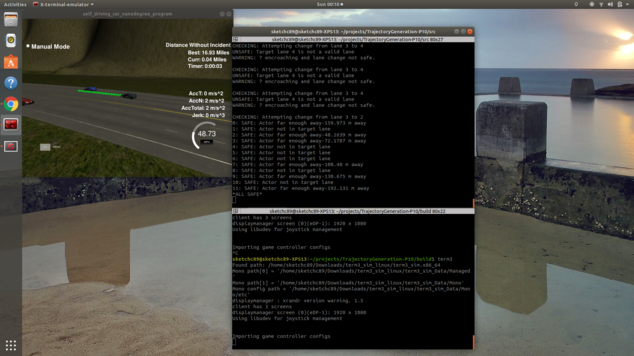

# Trajectory Planning

## Purpose

The purpose of this project is to develop a trajectory planner that is capable of safely and efficiently navigating a simulated highway.

## Results

* Best run: 16.93 m (>4.32 m)



## Building

```sh
mkdir build && cd build
cmake .. && make
```

## Running
```sh
./path_planning
```

Start term 3 simulator and select the Project 1: Path Planning project. 

## Explanation

### Path

* Host vehicle is the vehicle that the path planning program is being run on.
* Actor vehicles are vehicles in the environment.
* Vehicle uses spline library to generate path. A path is generated with points at the position of the vehicle one time step ago, the position of the vehicle at the current time step and points 45m, 90m, and 135m further along the path.
* The spline points are positioned at the center of the lane. A shift is introduced if a vehicle is hugging the left or right side of its lane closest to the host vehicle.
* The path is generated by first using whatever previous path was already generated. Usually this is 46 points.
* Additional points are added using the spline generated earlier. Fifty points are spaced evenly between the current position and 30m ahead of the current position along the spline. Points are added until the path has 50 points.

### Checks

* The host vehicle is constantly monitoring the position of actor vehicles.
* If an actor vehicle is in the same lane as the host vehicle and the host vehicle is driving faster than the actor vehicle. The host vehicle will set its speed to the actor vehicles speed and gradually slow to that speed. It also flags that it would like to change lanes.
* When a lane change is flagged, the vehicle will monitor the lanes to the left and right of it. It checks for actor vehicles to the side in the target lane, actor vehicles behind the host vehicle that are driving faster than the host, and actor vehicles in front of the host vehicle traveling slower than the host. It calculates a clearance that it needs given these speeds and determines whether the lane change is safe. If it is, then it sets its lane to the target lane.
* In addition the host is monitoring actors that are encroaching on its space. If an actor is encroaching from the left, it checks if a right lane change is safe and changes if so. If it's approaching from the right, then it checks if a left lane change is safe and changes if it is. If neither is safe and the encroachment is ahead of the vehicle it hard brakes. If it is behind the vehicle, then it should speed up. Due to the constraints of the project, a collision is equivalent to a speed limit violation, so we don't speed up.